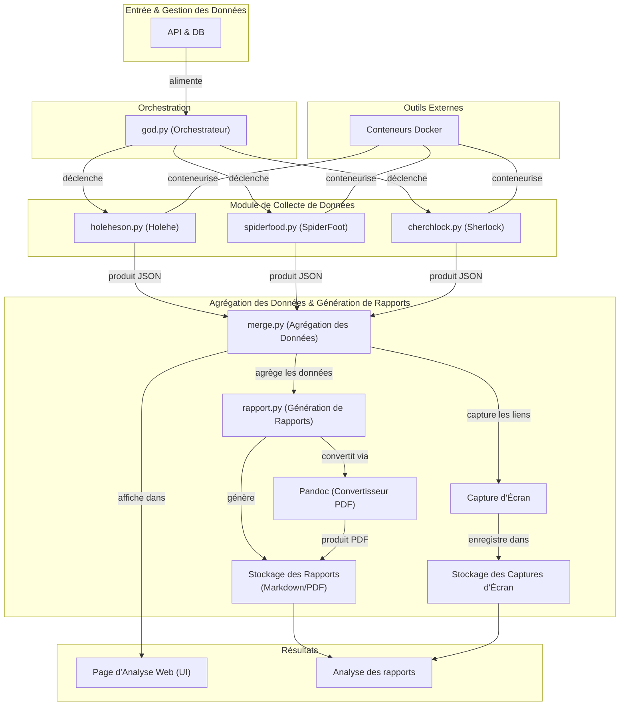

# Workzint

Ce projet est un workflow automatisé pour effectuer des analyses OSINT sur des adresses email et des noms d'utilisateur. Il combine plusieurs outils et scripts pour collecter, fusionner et analyser des données provenant de différentes sources, tout en générant des rapports détaillés.

## Objectifs du projet

1. **Automatisation** : Réduire le temps nécessaire pour effectuer des analyses OSINT manuelles.
2. **Centralisation** : Fusionner les données provenant de plusieurs outils en un seul rapport cohérent.
3. **Accessibilité** : Fournir des rapports lisibles et exploitables pour les utilisateurs.
4. **Confidentialité** : Garantir que les données collectées sont anonymisées et utilisées uniquement à des fins de validation.

## Fonctionnalités principales

1. **Collecte de données** :
   - Utilisation de plusieurs outils comme Holehe, SpiderFoot et Sherlock pour récupérer des informations sur des emails et des noms d'utilisateur.
   - Les résultats sont sauvegardés dans des fichiers JSON pour une analyse ultérieure.

2. **Fusion des données** :
   - Les données collectées sont fusionnées et enrichies grâce au script `merge.py`.
   - Les doublons sont éliminés et les informations sont organisées de manière cohérente.

3. **Génération de rapports** :
   - Des rapports détaillés sont générés pour chaque utilisateur, au format Markdown et PDF.
   - Les rapports incluent des statistiques, des conseils de sécurité et des informations sur les services détectés.

4. **Capture d'écran** :
   - Les liens détectés sont visités automatiquement pour capturer des captures d'écran, qui sont ensuite intégrées dans les rapports.

5. **Interface web** :
   - Une interface web interactive permet de visualiser les résultats et les statistiques globales.

6. **Orchestration complète** :
   - Le script `god.py` permet d'exécuter toutes les étapes du workflow de manière séquentielle.

## Structure du projet

- **`/result`** : Contient les fichiers JSON générés par les différents outils et les résultats fusionnés.
  - `holeheh_agg.json` : Résultats de Holehe.
  - `spiderfoot_agg.json` : Résultats de SpiderFoot.
  - `sherlock_agg.json` : Résultats de Sherlock.
  - `merged_result.json` : Résultat final fusionné.

- **`/rapport`** : Contient les rapports générés pour chaque utilisateur.
  - Les rapports sont organisés dans des sous-dossiers nommés d'après les emails ou noms d'utilisateur.

- **`/screen`** : Contient les captures d'écran des liens détectés.
  - Les captures d'écran sont nommées en fonction des emails et des indices des liens.

- **`/script`** : Contient les scripts Python utilisés pour orchestrer le workflow.
  - `holeheson.py` : Exécute Holehe pour collecter des données sur les emails.
  - `spiderfood.py` : Exécute SpiderFoot pour collecter des données sur les emails.
  - `cherchlock.py` : Exécute Sherlock pour collecter des données sur les noms d'utilisateur.
  - `merge.py` : Fusionne les données collectées et capture des captures d'écran.
  - `rapport.py` : Génère des rapports détaillés en Markdown et PDF.
  - `god.py` : Orchestrateur principal pour exécuter toutes les étapes du workflow.

- **`/site_web`** : Contient les fichiers pour l'interface web.
  - `api.php` : Fournit une API pour récupérer les données depuis une base de données.
  - `analyse.html` : Interface utilisateur pour visualiser les résultats et les statistiques.

## Prérequis

1. **Python 3.9+** :
   - Installez Python depuis [python.org](https://www.python.org/).

2. **Docker** :
   - Docker est utilisé pour exécuter les outils Holehe, SpiderFoot et Sherlock dans des containers isolés.
   - Installez Docker depuis [docker.com](https://www.docker.com/).
   - Docker doit être connecté à un compte [Docker Hub](https://hub.docker.com/).

3. **Pandoc** :
   - Utilisé pour convertir les rapports Markdown en PDF.
   - Installez Pandoc avec la commande suivante :
     ```sh
     sudo apt install pandoc
     ```

## Installation

1. Clonez le dépôt :
   ```sh
   git clone https://github.com/joblinours/workzint.git
   cd workzint
   ```

2. Installez les dépendances Python :
   ```sh
   pip install -r requirements.txt
   ```

## Configuration de l'API pour la récupération des emails

Pour permettre au script `god.py` de récupérer automatiquement les emails depuis votre propre base de données via l'API, suivez les étapes ci-dessous :

### 1. Préparer la base de données

Assurez-vous que votre base de données contient une table avec les colonnes nécessaires, notamment une colonne `email`. Voici un exemple de structure SQL minimale :

```sql
CREATE TABLE emails (
    id INT AUTO_INCREMENT PRIMARY KEY,
    email VARCHAR(255) NOT NULL
);
```
### 2. Configurer les fichiers d'environnement

Créez un fichier de configuration pour les identifiants de connexion à la base de données. Ce fichier doit être situé dans le dossier `.env` et nommé `.web_creds.conf`. Voici un exemple de contenu :

```
username="votre_nom_utilisateur"
password="votre_mot_de_passe"
mode="osint"
```

### 3. Configurer l'API

L'API est définie dans le fichier `site_web/api.php`. Assurez-vous que ce fichier est correctement configuré pour se connecter à votre base de données. Modifiez les paramètres suivants dans le fichier `api.php` :

```php
// ...existing code...
$creds_file = __DIR__ . '/../.env/creds.conf'; // Vérifiez que ce chemin est correct
// ...existing code...
```

### 4. Configuration des accès à la DB

Pour fonctionner, il faut aussi créer le fichier `.db_connect_osint` dans le dossier `.env`, et ce fichier doit contenir les informations suivantes :

```
servername = localhost
username = username_admin_db
password = password_admin_db
dbname = nom_de_la_db
tablename = nom_de_la_table
```

### 5. Tester l'API

Lancez un serveur PHP local pour tester l'API :

```sh
php -S localhost:8000 -t site_web
```

Ensuite, effectuez une requête POST vers l'API pour vérifier qu'elle retourne les emails correctement. Par exemple, utilisez `curl` :

```sh
curl -X POST -d "username=votre_nom_utilisateur&password=votre_mot_de_passe&mode=osint" http://localhost:8000/api.php
```

Vous devriez recevoir une liste d'emails en réponse.

### 6. Exécuter le script `god.py`

Une fois l'API configurée et fonctionnelle, exécutez le script `god.py` avec l'option appropriée pour récupérer les emails via l'API :

```sh
python3 script/god.py --osint
```

### Remarque

- Assurez-vous que le fichier `.web_creds.conf` est correctement configuré et que les identifiants correspondent à ceux définis dans votre base de données.
- Si vous utilisez un serveur distant, remplacez `localhost` par l'URL de votre serveur dans les tests et configurations.

## Utilisation

### Exécution complète du workflow

Utilisez le script `god.py` pour exécuter toutes les étapes du workflow :
```sh
python3 script/god.py --osint
```

### Exécution individuelle des scripts

Vous pouvez exécuter chaque script individuellement si nécessaire :
- `holeheson.py` : Collecte des données avec Holehe.
- `spiderfood.py` : Collecte des données avec SpiderFoot.
- `cherchlock.py` : Collecte des données avec Sherlock.
- `merge.py` : Fusionne les données collectées.
- `rapport.py` : Génère les rapports.

### Interface web

1. Lancez un serveur pour accéder à l'interface web :
   ```sh
   php -S localhost:8000 -t site_web
   ```

2. Accédez à l'interface via [http://localhost:8000/analyse.html](http://localhost:8000/analyse.html).

## Limitations

- Les scripts nécessitent une connexion Internet pour exécuter les containers Docker et capturer les captures d'écran.
- Les chemins des fichiers doivent être adaptés si vous déplacez le projet.
- Les performances peuvent varier en fonction du nombre d'emails et de noms d'utilisateur analysés.

## Évolutions possibles

Voici une liste des évolutions possibles pour ce projet :

- [ ] Ajouter un support pour d'autres outils OSINT.
- [ ] Ajouter une fonctionnalité de planification pour exécuter automatiquement les analyses à intervalles réguliers.
- [ ] Améliorer l'interface web avec des graphiques interactifs et des tableaux dynamiques.
- [ ] Ajouter une interface graphique (GUI) pour `god.py`.
- [ ] Ajouter un module d'analyse des réseaux sociaux.
- [ ] Ajouter une partie de dorking automatisée.
- [ ] Automatiser la distribution des rapports par mail.
- [ ] Et plus si affinité.

## Contributions

Les contributions sont les bienvenues ! Si vous souhaitez améliorer ce projet, n'hésitez pas à soumettre une pull request ou à ouvrir une issue.

## Licence

Ce projet est sous licence MIT. Consultez le fichier `LICENSE` pour plus d'informations.

## Diagramme du Workflow

Voici un diagramme représentant le workflow global du projet. Ce diagramme est compatible avec GitHub si l'option de rendu Mermaid est activée.


